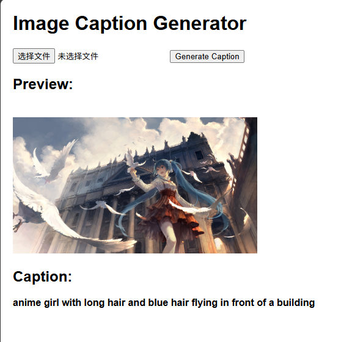

# Image caption demo

## Description

This is a demo which use `blip-image-captioning-large` to do image caption task with a web ui.

## How to use

### 1. download model

Download model from [huggingface repo](https://huggingface.co/Salesforce/blip-image-captioning-large) to the project’s root directory as below.

```
project_root/
│
├─ blip-image-captioning-large/
├─ static/
├─ templates/
│   └─ index.html
├─ demo.png
├─ main.py
├─ miku in vatican.jpg
├─ README.md
└─ requirements.txt
```

### 2. create environment and install dependencies

```bash
conda create -n image_caption_env python=3.11
conda activate image_caption_env
pip install -r requirements.txt
```

### 3. run main.py

```bash
python main.py
```

### 4. open URL

After starting the FastAPI server, open your browser and go to `http://localhost:8000`

following interface can be seen:


